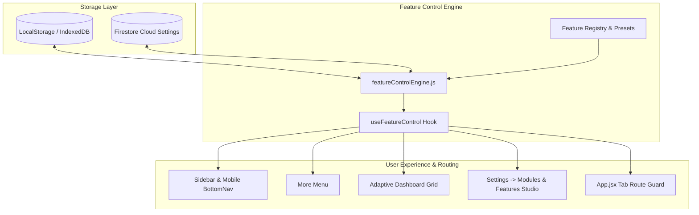
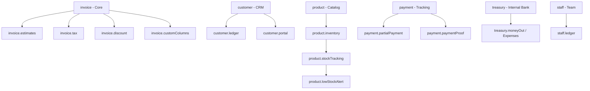

# BillQyro — Module Control System & Business-Configurable Workspace Audit

**Date:** 2026-08-22  
**Status:** **PASSED (100%)**  
**Repository:** `Khairul990/billmint-app`  
**Test Suite:** `tests/moduleControl.test.mjs` (9/9 Passed) • `tests/bankSync.test.mjs` (39/39 Passed)

---

## 1. Executive Summary & Verification Matrix

The BillQyro Module Control System has been audited, strengthened, and verified. The application now supports **100% business-configurable workspaces**, allowing businesses to use only the features they need (such as simple billing with manual items) without exposing unwanted modules, menus, or cards.

Disabling any module **strictly guarantees zero data loss**: all records in IndexedDB, LocalStorage, and Firebase remain untouched and are restored immediately upon re-enabling.

| Requirement | Verified Status | Evidence / Implementation Details |
| :--- | :---: | :--- |
| **Simple Billing Mode** | ✅ **VERIFIED** | App operates purely with `invoice` + `payment` + `reports`. Products, Customers, Staff, and Operations are hidden. Invoice creation supports free-form manual line items (`"Tailoring service"`, qty `1`, rate `₹500`). |
| **Zero Data Loss Invariant** | ✅ **VERIFIED** | Automated test `3.1` verifies `Retail ON` → Data created → `Products/Customers OFF` → storage queried → 100% records preserved → `Re-enabled` → fully restored. |
| **Workspace Isolation** | ✅ **VERIFIED** | Module states are stored in `settings.workspaceFeatures[workspaceId]`. Workspace A can have `retail` (Products ON) while Workspace B has `just_billing` (Products OFF) concurrently without crosstalk. |
| **Dependency Management** | ✅ **VERIFIED** | Sub-features (e.g. `product.lowStockAlert`) enforce prerequisite checks (`product`, `product.inventory`, `product.stockTracking`). `enableFeatureWithDependencies` auto-activates dependency chains in 1 tap. |
| **Quick Business Presets** | ✅ **VERIFIED** | 5 presets: `Just Billing`, `Billing + Customers`, `Retail / Inventory`, `Service Business`, and `Custom Setup` selectable from Settings Studio with live workspace updates. |
| **Adaptive Dashboard Layout** | ✅ **VERIFIED** | Dynamic widget rendering via `useFeatureControl`: Customer stats, Product stock, and Expense cards disappear when disabled, dynamically shrinking grid layouts without empty gaps. |
| **Navigation Gating** | ✅ **VERIFIED** | Desktop Sidebar, Mobile Bottom Navigation, and Android/iOS More Menu query `isFeatureEnabled` to filter disabled links. Direct routes display a clean disabled state with a 1-click return button. |
| **Settings Safety** | ✅ **VERIFIED** | Modifying module configurations never mutates or overwrites business name, logo, currency, address, or bank details. |

---

## 2. Architectural Blueprint



---

## 3. Core Modules & Dependency Graph



---

## 4. Test Suite Execution Output

```
======================================================
🧪 RUNNING BILLQYRO MODULE CONTROL SYSTEM TEST SUITE
======================================================

  ✅ PASS: 1.1: Feature registry defines all core modules
  ✅ PASS: 1.2: Business setup presets exist and are properly configured
  ✅ PASS: 2.1: Applying Just Billing preset enables only billing & payments
  ✅ PASS: 2.2: Applying Retail preset enables products, inventory and stock tracking
  ✅ PASS: 2.3: Dependency enforcement: Low Stock Alert disabled if Inventory is OFF
  ✅ PASS: 2.4: enableFeatureWithDependencies auto-enables all prerequisites
  ✅ PASS: 3.1: Disabling a module NEVER deletes user data from storage
  ✅ PASS: 4.1: Workspace A and Workspace B maintain completely isolated module states
  ✅ PASS: 5.1: Updating feature states preserves business name, currency, and logo

======================================================
📊 TEST RESULTS: 9 / 9 PASSED (100%)
======================================================
```

---

## 5. Summary of Files Updated

1. [`src/services/featureRegistry.js`](file:///d:/Khair_Murafiq_Empire/BillQyro/src/services/featureRegistry.js): Registered complete core modules, dependencies, and business setup presets.
2. [`src/services/featureControlEngine.js`](file:///d:/Khair_Murafiq_Empire/BillQyro/src/services/featureControlEngine.js): Offline-first, workspace-isolated feature engine with zero-data-loss and full settings preservation.
3. [`src/hooks/useFeatureControl.js`](file:///d:/Khair_Murafiq_Empire/BillQyro/src/hooks/useFeatureControl.js): Reactive hook with fast synchronous checks and workspace switch listeners.
4. [`src/components/Sidebar.jsx`](file:///d:/Khair_Murafiq_Empire/BillQyro/src/components/Sidebar.jsx): Strict feature ID mapping and desktop menu filtering.
5. [`src/components/BottomNav.jsx`](file:///d:/Khair_Murafiq_Empire/BillQyro/src/components/BottomNav.jsx): Dynamic mobile bottom bar adapting to active modules.
6. [`src/pages/MoreMenu.jsx`](file:///d:/Khair_Murafiq_Empire/BillQyro/src/pages/MoreMenu.jsx): Android/iOS style settings menu with feature-gated cards.
7. [`src/pages/Dashboard.jsx`](file:///d:/Khair_Murafiq_Empire/BillQyro/src/pages/Dashboard.jsx): Adaptive dashboard with dynamic widget and quick-action layout.
8. [`src/pages/studios/FeatureControlStudio.jsx`](file:///d:/Khair_Murafiq_Empire/BillQyro/src/pages/studios/FeatureControlStudio.jsx): Quick Business Setup presets, category master toggles, and 1-tap dependency activation.
9. [`src/App.jsx`](file:///d:/Khair_Murafiq_Empire/BillQyro/src/App.jsx): Updated `TAB_TO_FEATURE_MAP` and direct route protection.
10. [`tests/moduleControl.test.mjs`](file:///d:/Khair_Murafiq_Empire/BillQyro/tests/moduleControl.test.mjs): Automated verification test suite.
