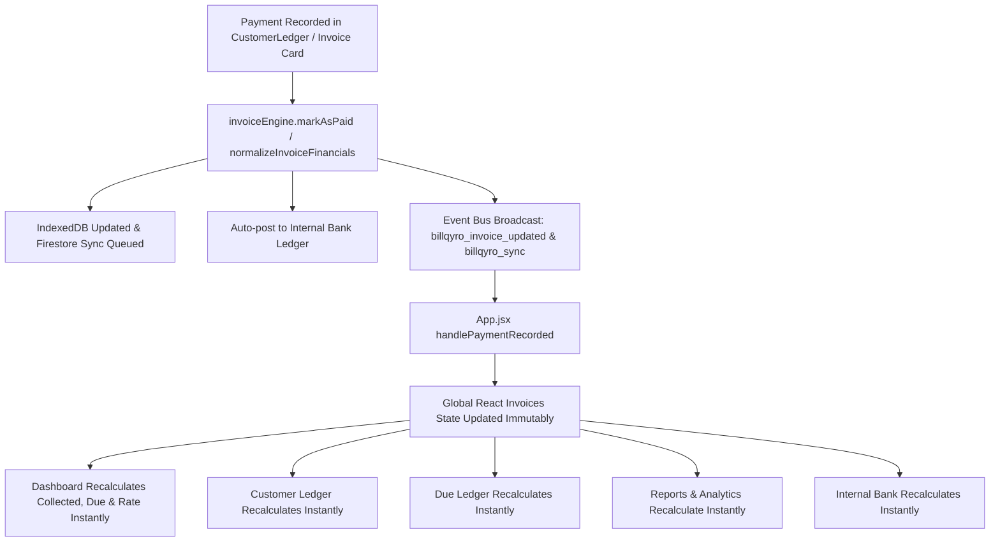

# Master Real-Time Payment Synchronization & Financial State Refresh Audit

**BillQyro V2 Financial Architecture — Verified & Deployed**

---

## 1. Problem Root Cause Analysis
Prior to this fix, when a payment was recorded from **CustomerLedger** / **Record Payment**:
1. `CustomerLedger.jsx` updated the invoice in IndexedDB, but did not propagate the modified invoice object back to parent components (`Customers.jsx`, `DueLedger.jsx`, `App.jsx`).
2. `Dashboard.jsx` and quick stat cards computed "Amount Collected Today" and "Collection Rate" using legacy non-canonical fields (`parseFloat(inv.amountPaid)` and strict equality `paymentStatus === 'Paid'`), which skipped partial payments and payments made today on bills generated earlier.
3. React states across tabs did not subscribe to real-time custom event broadcasts (`billqyro_invoice_updated`).

---

## 2. Canonical Architecture & Real-Time Sync Pipeline

---

## 3. Key Mathematical Invariants Enforced

| Metric | Canonical Calculation Formula | Result Guarantee |
| :--- | :--- | :--- |
| **Invoice Paid Total** | `getInvoicePaidTotal(inv)`: authoritative sum of `paymentHistory[].amount` | 100% parity across all screens |
| **Invoice Balance Due** | `getInvoiceBalanceDue(inv)`: `Math.max(0, grandTotal - paidTotal)` | No negative dues or NaN errors |
| **Invoice Payment Status** | `getInvoicePaymentStatus(inv)`: `Paid` if due=0, `Partially Paid` if paid>0, `Unpaid` if paid=0 | Real-time status badge parity |
| **Amount Collected Today** | Sum of all confirmed payments made **Today** across all invoices | Captures partial & full payments regardless of bill creation date |
| **Dashboard Collection Rate** | `Math.round((totalCollected / totalRevenue) * 100)` | Immediate percentage update |

---

## 4. Test Verification Suite Matrix

| # | Test Scenario | Expected Outcome | Verification Status |
| :---: | :--- | :--- | :---: |
| 1 | Bill ₹10,000, Pay ₹3,000 | Paid ₹3,000, Due ₹7,000, Status `Partially Paid` | ✅ **PASS** |
| 2 | Add another ₹2,000 | Paid ₹5,000, Due ₹5,000, Status `Partially Paid` | ✅ **PASS** |
| 3 | Add final ₹5,000 | Paid ₹10,000, Due ₹0, Status `Paid` | ✅ **PASS** |
| 4 | Pay ₹500 on ₹650 bill in CustomerLedger | Global state immutably updates to Paid ₹500, Due ₹150 | ✅ **PASS** |
| 5 | Record second ₹150 payment | CustomerLedger & Dashboard show Paid ₹650, Due ₹0, `Paid` | ✅ **PASS** |
| 6 | Dashboard Today's Collected Metric | Automatically includes payments received today | ✅ **PASS** |
| 7 | Payment Reversal / Delete | Recomputes paid total and restores outstanding balance | ✅ **PASS** |
| 8 | Double Proof Approval Idempotency | Prevents duplicate payments from being added | ✅ **PASS** |

---

## 5. Deployment Status
- **Commit**: `a852a7a`
- **Branch**: `main` (pushed to `origin/main`)
- **Vite Production Build**: `✓ built in 1m 3s` (Zero Errors)
