# BillQyro — Owner Admin Control Room Final Audit & Architecture Report

## 1. Executive Summary

This audit document details the master audit, hardening, and premium architectural upgrade of the **BillQyro Owner Admin Control Room** on the `audit/fix-broken-business-features` branch.

All requested navigation structures, truthful telemetry probes, tenant isolation safeguards, atomic payment approvals, maintenance mode cloud synchronization, schema-validated backups, and comprehensive audit logs have been implemented and verified with zero financial regressions.

---

## 2. Original Problems & Gaps Identified

| Component / Subsystem | Original State | Identified Gap / Vulnerability | Resolution Status |
| :--- | :--- | :--- | :--- |
| **Admin Sidebar** | Flashy infinite animations, flat navigation, missing responsive drawer | Violated luxury Linear/Stripe aesthetic; lacked required 6 functional groups. | ✅ RESOLVED |
| **Command Center KPIs** | Approximated / hardcoded fallback calculations | Displayed mock metrics instead of handling missing/offline data honestly. | ✅ RESOLVED |
| **Maintenance Mode** | Stored only in browser `localStorage` | Did not synchronize across platform clients or block remote tenants globally. | ✅ RESOLVED |
| **Payment Approvals** | Shallow status updates without full audit trail | Lacked duplicate approval prevention and detailed rejection reason workflows. | ✅ RESOLVED |
| **Backup & Restore** | Toast notification placeholder stubs | "Create Backup" and "Restore Backup" had no schema validation or file importers. | ✅ RESOLVED |
| **Dangerous Operations** | Standard browser `window.confirm` dialogs | High-risk routines (cache purge, reset) lacked typed confirmation safety gates. | ✅ RESOLVED |
| **Security & Audit Logs** | Local-only unindexed arrays | Lacked structured schema logging (Actor, Action, Target, Result, Metadata). | ✅ RESOLVED |

---

## 3. Architecture & Navigation Structure

The Owner Control Room is structured into **6 distinct operational domains**:

```mermaid
graph TD
    Owner[Owner Admin PIN / Session] --> Console[Admin Control Room]

    Console --> G1[1. OVERVIEW]
    G1 --> Tab_Dash[Command Center - Real Telemetry & KPIs]

    Console --> G2[2. USERS & WORKSPACES]
    G2 --> Tab_Users[User Management & Plan Control]
    G2 --> Tab_Workspaces[Workspace Multi-Tenant Registry]
    G2 --> Tab_Subs[Subscription Plans Studio]

    Console --> G3[3. FINANCIAL]
    G3 --> Tab_Payments[Payment Proofs & Approvals]
    G3 --> Tab_Revenue[Platform Revenue & Settlement]
    G3 --> Tab_Billing[Billing Parameters & Rates]

    Console --> G4[4. PLATFORM]
    G4 --> Tab_Announce[Announcement Center]
    G4 --> Tab_Modules[Feature Controls & Modules]
    G4 --> Tab_Maint[Global Maintenance Mode]
    G4 --> Tab_Health[System Health & Telemetry]

    Console --> G5[5. DATA]
    G5 --> Tab_Backup[Full Backup & Safe Restore]
    G5 --> Tab_Storage[Storage & IndexedDB Diagnostics]
    G5 --> Tab_Sync[Sync & Edge Network Diagnostics]

    Console --> G6[6. SECURITY]
    G6 --> Tab_Sec[Security & PIN Authorization]
    G6 --> Tab_Audit[Administrative Audit Logs]
    G6 --> Tab_Owner[Owner Controls & Danger Center]
```



---

## 4. Admin Control Gap Analysis

| Route ID | Display Label | Group | UI State | Handler State | Backend Connection | Audit Logged? | Verification Classification |
| :--- | :--- | :--- | :---: | :---: | :---: | :---: | :---: |
| `dashboard` | Command Center | OVERVIEW | ✅ | ✅ | ✅ Firestore / IndexedDB | ✅ | **WORKING** |
| `users` | Users | USERS & WORKSPACES | ✅ | ✅ | ✅ `usersList` / Scoped | ✅ | **WORKING** |
| `workspaces` | Workspaces | USERS & WORKSPACES | ✅ | ✅ | ✅ `settings` / Registry | ✅ | **WORKING** |
| `subscriptions` | Plans & Subscriptions | USERS & WORKSPACES | ✅ | ✅ | ✅ Firestore Plans | ✅ | **WORKING** |
| `payments` | Payment Proofs | FINANCIAL | ✅ | ✅ | ✅ `paymentProofs` Collection | ✅ | **WORKING** |
| `revenue` | Platform Revenue | FINANCIAL | ✅ | ✅ | ✅ `platformRevenue` | ✅ | **WORKING** |
| `billing` | Billing Configuration | FINANCIAL | ✅ | ✅ | ✅ `adminSettings` | ✅ | **WORKING** |
| `announcements`| Announcements | PLATFORM | ✅ | ✅ | ✅ `adminAnnouncements` | ✅ | **WORKING** |
| `modules` | Feature Controls | PLATFORM | ✅ | ✅ | ✅ FeatureControlStudio | ✅ | **WORKING** |
| `maintenance` | Maintenance Mode | PLATFORM | ✅ | ✅ | ✅ Global Cloud + Local | ✅ | **WORKING** |
| `health` | System Health | PLATFORM | ✅ | ✅ | ✅ Browser APIs + Telemetry | ✅ | **WORKING** |
| `backup` | Backup & Restore | DATA | ✅ | ✅ | ✅ Multi-Store IndexedDB | ✅ | **WORKING** |
| `storage` | Storage Diagnostics | DATA | ✅ | ✅ | ✅ `BillQyroDB` Object Stores | ✅ | **WORKING** |
| `sync` | Sync Diagnostics | DATA | ✅ | ✅ | ✅ Latency & Offline Queue | ✅ | **WORKING** |
| `security` | Security Center | SECURITY | ✅ | ✅ | ✅ PBKDF2 PIN / Session | ✅ | **WORKING** |
| `audit` | Audit Logs | SECURITY | ✅ | ✅ | ✅ `adminAuditLogs` | ✅ | **WORKING** |
| `owner-controls`| Owner Controls | SECURITY | ✅ | ✅ | ✅ Typed Modal Confirmation | ✅ | **WORKING** |

---

## 5. Security Model & Data Isolation

1. **Authentication Boundary (`AdminRouteGuard`)**:
   - Access strictly gated behind PBKDF2 PIN verification or verified `isSuperAdmin` session.
   - Non-authorized sessions attempting direct URL access (`/km-admin`) are immediately served the PIN lockout dialog.
2. **Tenant Scoping (`userId` + `workspaceId`)**:
   - Administrative inspection queries preserve partition isolation without leaking cross-tenant customer or financial data.
3. **Destructive Action Safety**:
   - High-privilege routines (data purge, workspace reset, account suspension) require explicit typed confirmation strings (e.g. `"PURGE CACHE"`, `"RESET BUSINESS DATA"`).
4. **Zero Frontend Secrets**:
   - Sensitive credentials, master API keys, and service account tokens are excluded from client bundles.

---

## 6. End-to-End Operational Workflows

### A. Global Maintenance Mode
1. Owner engages toggle in **Platform → Maintenance Mode**.
2. Engine writes `{ maintenanceMode: true, maintenanceReason: "...", maintenanceDuration: "..." }` to Firestore `globalAdminSettings` and mirrors to `localStorage`.
3. Client app interceptor in `src/App.jsx` evaluates state:
   - If `maintenanceMode === true` and session is not authenticated as owner, normal application shells are blocked and replaced with the customized Maintenance notice.
   - Owner console retains uninterrupted access.
4. Mutation creates an immutable record in `adminAuditLogs`.

### B. Payment Settlement & Proof Verification
1. User uploads payment receipt on public billing / upgrade screen.
2. Proof appears in **Financial → Payment Proofs** under `Pending`.
3. Owner inspects uploaded receipt, transaction reference ID, and user workspace ID.
4. Owner selects **Approve**:
   - Atomically updates authoritative payment state.
   - Idempotency guard prevents duplicate re-approvals.
   - Logs `PAYMENT_PROOF_APPROVED` audit event.
5. If rejecting, owner inputs mandatory rejection reason; tenant receives contextual notice.

### C. Backup & Schema-Validated Restore
1. **Backup**: `adminEngine.createPlatformBackup()` snapshots all 11 active stores (`invoices`, `customers`, `products`, `expenses`, `settings`, `bankLedger`, `bankCredit`, `appointments`, `orders`, `activities`, `announcements`) with schema version `8.0.0`.
2. **Restore**: File reader validates JSON schema, previews record counts per store in a confirmation modal, and applies non-destructive idempotent upserts.

---

## 7. Verification & Automated Test Results

### Regression Suites: **23 / 23 Passed (100%)**

```
======================================================
🚀 RUNNING COMPLETE BILLQYRO REGRESSION TEST SUITE (23 test suites)
======================================================

▶️  SUITE: adminControlRoom.test.mjs            -> 7/7 PASS (100%)
▶️  SUITE: announcementSystem.test.mjs          -> 9/9 PASS (100%)
▶️  SUITE: authLifecycle.test.mjs               -> 9/9 PASS (100%)
▶️  SUITE: backupRestore.test.mjs               -> PASS (100%)
▶️  SUITE: bankSync.test.mjs                    -> 39/39 PASS (100%)
▶️  SUITE: businessWorkflow.test.mjs            -> PASS (100%)
▶️  SUITE: canonicalFinancialParity.test.mjs    -> PASS (100%)
▶️  SUITE: customerLedger.test.mjs              -> PASS (100%)
▶️  SUITE: dashboardUX.test.mjs                 -> PASS (100%)
▶️  SUITE: expenseManagement.test.mjs           -> PASS (100%)
▶️  SUITE: finalProductionVerification.test.mjs -> PASS (100%)
▶️  SUITE: inventory.test.mjs                   -> PASS (100%)
▶️  SUITE: invoiceCreation.test.mjs             -> PASS (100%)
▶️  SUITE: invoiceEditResetRegression.test.mjs  -> PASS (100%)
▶️  SUITE: invoiceEditSaveLifecycle.test.mjs    -> PASS (100%)
▶️  SUITE: moduleControl.test.mjs               -> PASS (100%)
▶️  SUITE: offlineReliability.test.mjs          -> PASS (100%)
▶️  SUITE: onboarding.test.mjs                  -> PASS (100%)
▶️  SUITE: paymentCollections.test.mjs          -> 26/26 PASS (100%)
▶️  SUITE: realtimePaymentSync.test.mjs         -> 8/8 PASS (100%)
▶️  SUITE: reportsAnalytics.test.mjs            -> 37/37 PASS (100%)
▶️  SUITE: securityAudit.test.mjs               -> 13/13 PASS (100%)
▶️  SUITE: workspaceLifecycle.test.mjs          -> 11/11 PASS (100%)

======================================================
📊 FINAL REGRESSION SUMMARY
   Passed Suites: 23 / 23
   Failed Suites: 0
🎉 ALL 23 TEST SUITES PASSED PERFECTLY (100%)!
======================================================
```

### Static Analysis (ESLint)
- **Result**: `0 errors` (Code 0).

---

## 8. Financial Invariant Verification

Before and after admin architectural changes, all core financial equations remain consistent:
- `Total Invoiced = Subtotal + Tax - Discounts`
- `Total Paid + Balance Due = Grand Total`
- `Customer Dues = Sum(Invoice Dues) - Unallocated Credits`
- `Bank Ledger Balance = Inflows - Outflows`
- `Net Profit = Revenue - Total Expenses`

---

## 9. Conclusion & Production Readiness
The **Owner Admin Control Room** is **fully hardened, verified, tested, and READY FOR MERGE**.
