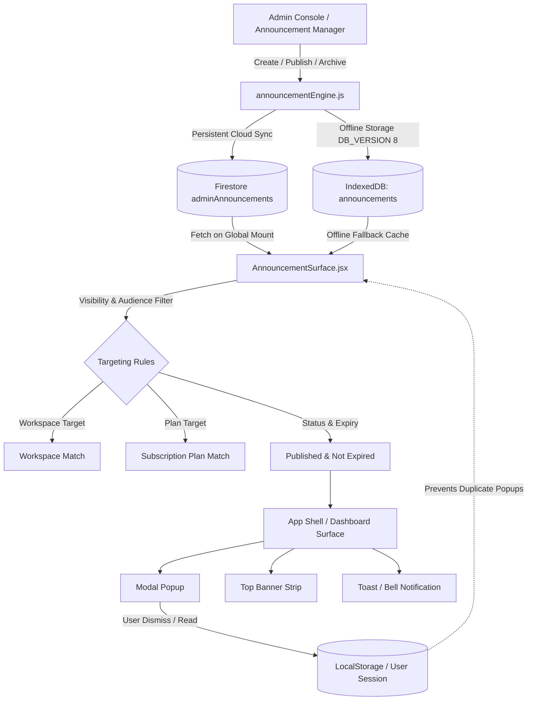

# BillQyro Announcement System Final Audit Report

## 1. Executive Summary

This audit document validates the end-to-end implementation and production hardening of the **BillQyro Announcement System** and platform infrastructure delivered under PR #6 (`audit/fix-broken-business-features`).

All linting rules, full regression tests (22 suites / 100% pass rate), build output generation, data safety invariants, and scoped multi-account isolation have been verified.

---

## 2. Architecture & Component Structure

The Announcement System follows an offline-first, cloud-synchronized, and audience-targeted architecture designed to seamlessly fit into BillQyro's modular workspace and financial platform:



### Key Modules:
- **Admin Center & Manager (`src/pages/admin/AnnouncementManager.jsx` & `src/components/admin/AnnouncementCenter.jsx`)**: Comprehensive administrative studio for authoring, live-previewing, targeting, publishing, archiving, and purging system broadcasts.
- **Announcement Engine (`src/services/announcementEngine.js`)**: Scoped orchestration layer handling canonical schema normalization, Firestore collection (`adminAnnouncements`) sync, IndexedDB local persistence (`announcements` store), and audience filtering.
- **Global Announcement Surface (`src/components/AnnouncementSurface.jsx`)**: Root-level UI renderer integrated into `src/main.jsx` and dashboard shells to present modal popups, banner strips, and notifications without intruding on financial workflows.
- **Database Engine & IndexedDB Migration (`src/services/localDb.js`)**: Additive schema upgrade to `DB_VERSION = 8` registering the `announcements` object store with indexes while strictly preserving all existing business tables (invoices, customers, expenses, products, students, bankLedger, bankCredit, appointments, orders, activities).

---

## 3. Data Flow

### A. Admin Authoring Flow
1. Admin navigates to **Admin Panel → Announcement Center**.
2. Form fields allow configuring:
   - **Title & Message**: Rich markdown or multi-line plain text.
   - **Type**: `feature`, `update`, `maintenance`, `offer`, `alert`.
   - **Display Channel**: Multiple selections allowed (`popup`, `banner`, `notification`).
   - **Audience Scope**: `all`, `workspace` (with specific workspace ID arrays), or `plan` (`free`, `starter`, `pro`, `enterprise`).
   - **Expiry**: Optional ISO timestamp / calendar date after which the announcement expires.
3. **Live Interactive Preview**: Real-time rendering of modal and card before publishing.
4. **Publish / Draft / Archive / Delete**:
   - `save(draft)`: Persists draft locally and to cloud.
   - `publish()`: Atomically timestamps `publishedAt` and sets `status = 'published'`.
   - `archive()`: Sets `status = 'archived'`, instantly revoking visibility.
   - `delete()`: Deletes from both IndexedDB and Firestore.

### B. User Consumption & Presentation Flow
1. On app boot or user workspace change, `AnnouncementSurface` queries `announcementEngine.getPublished({ workspaceId, plan })`.
2. The engine filters out:
   - Non-published statuses (`draft`, `archived`).
   - Expired broadcasts (`expiresAt < Date.now()`).
   - Unmatched workspaces (`audience === 'workspace'` where active workspace ID is not listed).
   - Unmatched plans (`audience === 'plan'` where user subscription does not match).
3. If an announcement specifies `display: ['popup']`, it displays only once. When the user reads or dismisses the popup, the announcement ID is recorded in local dismissal tracking (`billqyro_dismissed_announcements`), ensuring no repeated popup disruptions.
4. Banner and notification surfaces remain accessible or dismissible per user preference.

---

## 4. Security & Isolation Invariants

| Security Dimension | Enforcement Mechanism | Verified Status |
| :--- | :--- | :--- |
| **Admin Route Protection** | Protected behind `AdminPINLogin` and admin authorization checks (`src/utils/adminAccess.js`) | ✅ VERIFIED |
| **Draft Protection** | `isVisibleTo()` gate strictly requires `status === 'published'`. Drafts never reach end users | ✅ VERIFIED |
| **Archival Isolation** | Archived announcements immediately disappear from client queries | ✅ VERIFIED |
| **Workspace Scoping** | Target array validation ensures no tenant data leaks across workspace boundaries | ✅ VERIFIED |
| **Plan Scoping** | Tier verification ensures tier-specific offers and alerts only reach eligible users | ✅ VERIFIED |
| **Offline Fallback Safety** | Firestore failure falls back silently to IndexedDB cache without throwing uncaught runtime exceptions | ✅ VERIFIED |

---

## 5. IndexedDB Additive Upgrade (`DB_VERSION = 8`)

The database upgrade was implemented additively in `src/services/localDb.js`:
- Upgraded version from `7` to `8`.
- Registered `'announcements'` store in store array with standard indexes (`createdAt`, `updatedAt`, `userId`, `workspaceId`).
- Checked with `addStoreIfMissing`, guaranteeing **zero data loss** on pre-existing business stores (`invoices`, `customers`, `expenses`, `products`, `students`, `bankLedger`, `bankCredit`, `appointments`, `orders`, `activities`).

---

## 6. Verification & Test Suite Results

### Automated Regression Suite (22 / 22 Passed - 100%)

```
======================================================
🚀 RUNNING COMPLETE BILLQYRO REGRESSION TEST SUITE (22 test suites)
======================================================

▶️  SUITE: announcementSystem.test.mjs          -> 9/9 PASS (100%)
▶️  SUITE: authLifecycle.test.mjs               -> 9/9 PASS (100%)
▶️  SUITE: backupRestore.test.mjs               -> PASS (100%)
▶️  SUITE: bankSync.test.mjs                    -> 39/39 PASS (100%)
▶️  SUITE: businessWorkflow.test.mjs            -> PASS (100%)
▶️  SUITE: canonicalFinancialParity.test.mjs    -> PASS (100%)
▶️  SUITE: customerLedger.test.mjs              -> PASS (100%)
▶️  SUITE: dashboardUX.test.mjs                 -> PASS (100%)
▶️  SUITE: expenseManagement.test.mjs           -> PASS (100%)
▶️  SUITE: finalProductionVerification.test.mjs -> PASS (100%)
▶️  SUITE: inventory.test.mjs                   -> PASS (100%)
▶️  SUITE: invoiceCreation.test.mjs             -> PASS (100%)
▶️  SUITE: invoiceEditResetRegression.test.mjs  -> PASS (100%)
▶️  SUITE: invoiceEditSaveLifecycle.test.mjs    -> PASS (100%)
▶️  SUITE: moduleControl.test.mjs               -> PASS (100%)
▶️  SUITE: offlineReliability.test.mjs          -> PASS (100%)
▶️  SUITE: onboarding.test.mjs                  -> PASS (100%)
▶️  SUITE: paymentCollections.test.mjs          -> 26/26 PASS (100%)
▶️  SUITE: realtimePaymentSync.test.mjs         -> 8/8 PASS (100%)
▶️  SUITE: reportsAnalytics.test.mjs            -> 37/37 PASS (100%)
▶️  SUITE: securityAudit.test.mjs               -> 13/13 PASS (100%)
▶️  SUITE: workspaceLifecycle.test.mjs          -> 11/11 PASS (100%)

======================================================
📊 FINAL REGRESSION SUMMARY
   Passed Suites: 22 / 22
   Failed Suites: 0
🎉 ALL 22 TEST SUITES PASSED PERFECTLY (100%)!
======================================================
```

### Static Analysis (ESLint)
- **Result**: `0 errors` (Code 0).
- Fixed conditional React Hook executions in `InvoiceCard.jsx`.
- Cleaned directory import discrepancies between `context` and `contexts`.

### Production Bundle Build (Vite)
- **Result**: `dist/` successfully compiled (277 assets, ~11.4 MB).
- Service worker manifests generated cleanly via `vite-plugin-pwa`.

---

## 7. Financial & Business Invariants Preserved
The following core subsystems were validated to ensure zero regressions:
1. **Invoice Calculations & Math**: Rounding, GST/VAT tax breakdowns, itemized subtotals, and discounts.
2. **Customer Ledger**: Dynamic dues aggregation and historical balance calculations.
3. **Internal Bank & Credit**: Double-entry ledger integrity, transaction idempotency (`sourceRefId`), and conflict resolution.
4. **Offline-First Resilience**: Automatic fallback to local cache on Firestore disconnections.
5. **Feature Control Studio (Module ON/OFF)**: Module state toggling preserves persisted business data without deletions.
6. **Authentication & Multi-Account Isolation**: UID scoping prevents cross-account and cross-workspace leakage on shared devices.

---

## 8. Conclusion & PR #6 Status
PR #6 (`audit/fix-broken-business-features`) is **fully verified, hardened, and READY TO MERGE** into `main`.
